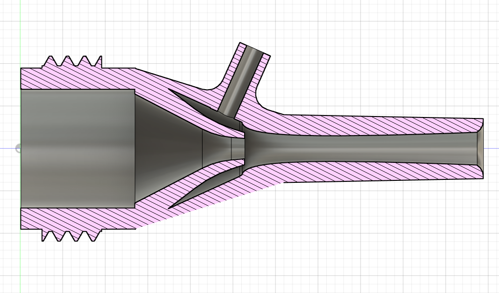
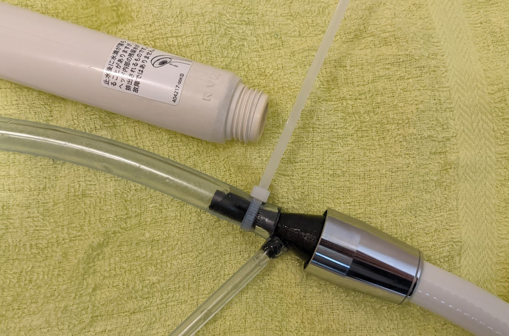

# Aspirator3D
3Dプリンタで作るアスピレータです。  
  
  

# 使い方
シャワーヘッドの先に装着して使用します。ネジ規格はKVK(M22x2)です。3Dプリンタで印刷する際には、98%程度にスケーリングすると良さげです。  
水道の圧力やプリント精度によって変動すると思いますが、水道水の流量は4L/min程度でした。
https://twitter.com/twi_kingyo/status/1382319279232544773

